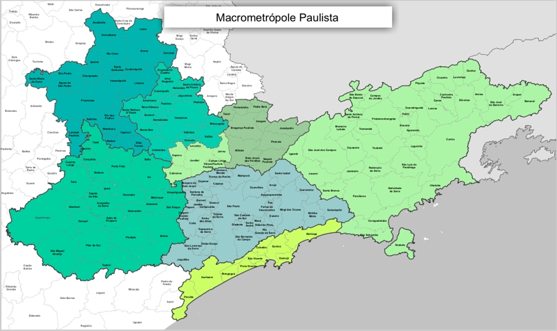

```{r setup, include=FALSE}
knitr::opts_chunk$set(
	echo = FALSE,
	message = FALSE,
	warning = FALSE
)

library(magrittr)
library(ggplot2)
```

```{r}
# url <- "https://docs.google.com/spreadsheets/d/1oEd1bktywsgeZoRRD3SdrM8zuxMdYwa9oBgN2cknbUM/edit?usp=sharing"
# 
# base_raw <- googlesheets4::read_sheet(url)
# 
# write.csv2(base_raw, file = "dados/base_2020_googlesheets.csv")

base_raw <- read.csv2("dados/base_2020_googlesheets.csv")

base <- base_raw %>% 
    dplyr::mutate(
    ano = as.character(year),
    ano = readr::parse_date(ano, format = "%Y")#,
    #ano = lubridate::year(ano)
    )

```


# Levantamento exploratório de estudos sobre a Governança ambiental na Macrometrópole Paulista 

Beatriz Milz ^[Doutoranda no Programa de Pós-graduação em Ciência Ambiental (PROCAM), do Instituto de Energia e Ambiente (IEE) da Universidade de São Paulo (USP). Email: beatriz.milz@usp.br], Pedro Roberto Jacobi ^[....]


__Palavras-chave:__ Mudanças Climáticas, Governança da Água, Governança Metropolitana, Crise hídrica, Região Metropolitana de São Paulo.


## Introdução

A Macrometrópole Paulista (MMP) (Figura 1) é considerada a maior e mais importante aglomeração urbana do Brasil, e abrange as regiões metropolitanas de São Paulo, Campinas, Sorocaba, Baixada Santista, Vale do Paraíba e Litoral Norte, as aglomerações urbanas de Jundiaí e Piracicaba, e as microrregiões de Bragantina e São Roque [@emplasaPlanoAcaoMacrometropole2012; @daeeMacrometropoleSumarioExecutivo2013]. Segundo a Empresa Paulista de Planejamento Metropolitano (EMPLASA), a MMP é composta por 174 municípios e em 2018 concentrava uma população de 33,6 milhões de habitantes [@emplasaRegiaoMetropolitanaSao2019]. 


```{r mapaemplasa, fig.cap="Figura 1: Mapa da MMP, localizada no Estado de São Paulo, Brasil. \\linebreak Fonte: @emplasaRegiaoMetropolitanaSao2019."}

```


A MMP apresenta grande complexidade em termos de gestão, e os problemas a serem enfrentados também apresentam grandes dimensões, tais como o déficit habitacional, estresse hídrico e abastecimento de água, entre outros [@castroExpansaoMacrometropoleCriacao2017]. Neste contexto, é importante que o planejamento realizado para Macrometrópole Paulista considere os efeitos das mudanças climáticas, pois, segundo o Painel Intergovernamental sobre Mudanças Climáticas (IPCC), elas irão amplificar os riscos existentes e criar novos riscos para os sistemas naturais e humanos [@ipcc_climate_2014]. 

Considerando a complexidade territorial apresentada pela MMP, é fundamental destacar a importância do conceito de governança ambiental. @lemosEnvironmentalGovernance2006 (p. 298) referem-se à governança ambiental como “o conjunto de processos regulatórios, mecanismos e organizações através dos quais os atores políticos influenciam as ações e resultados ambientais”. @jacobiGovernancaAmbientalEconomia2012 (p. 1471) apontam que “a governança ambiental envolve todos e cada um nas decisões sobre o meio ambiente, por meio das organizações civis e governamentais”. 


Segundo @pedrorobertojacobiCapitulo16Mudancas2018, “a governança ambiental do espaço urbano pode ser chave no alcance de uma condição de sustentabilidade e redução de vulnerabilidades aos desastres, principalmente aqueles relacionados aos eventos extremos decorrentes do aquecimento global, que tendem a se agravar” [@pedrorobertojacobiCapitulo16Mudancas2018, p. 349]. Considerando a importância do avanço nos estudos sobre a governança ambiental na Macrometrópole Paulista, neste trabalho é apresentado um levantamento exploratório de artigos científicos que abordam a MMP, publicados até 2018, com o objetivo de identificar pesquisas que tratem sobre a Governança Ambiental na MMP, no contexto das mudanças climáticas.

## Metodologia

As pesquisas foram realizadas em novembro de 2020, nas seguintes plataformas: Periódicos CAPES (http://www.periodicos.capes.gov.br/), *Scientific Electronic Library Online* (SciELO) (http://www.scielo.org/), *Scopus* (https://www.scopus.com/) e *Google Scholar* (https://scholar.google.com.br/). Foram pesquisados artigos que continham, em seu título,  algum dos seguintes termos: “Macrometrópole”, “Macrometrópole Paulista”, “Macrometrópole de São Paulo”, "Macrometropolização", “*Macrometropolis*” e “*Sao Paulo Macrometropolis*”.

Os resultados foram coletados e organizados em uma tabela, considerando os seguintes critérios: data da pesquisa, plataforma da pesquisa onde o trabalho foi encontrado, título da publicação, autoras(es), periódico científico na qual o trabalho foi publicado, idioma de publicação, ano de publicação e endereço online do trabalho (URL). Foram filtrados e apagados os trabalhos repetidos, considerando que existe a possibilidade de um mesmo trabalho ser indicado nos diferentes plataformas pesquisadas.
<!-- Foram encontrados artigos que citavam a MMP em seu título, porém não tratava do tema no desenvolvimento do trabalho, portanto foram retirados deste estudo. -->


A etapa posterior constou em verificar os trabalhos encontrados, com a finalidade de responder às seguintes perguntas:  Em que ano os artigos foram publicados? Em quais periódicos os mesmos foram publicados? De que forma o projeto temático MacroAmb tem contribuído para a produção de conhecimento sobre a Macrometrópole Paulista?

Para a realização das diversas etapas da análise dos dados (como importação, limpeza, manipulação, visualização) foi utilizado os softwares R [@R-base], RStudio [@rstudio] e os seguintes pacotes: @R-tidyverse.
<!-- A quais instituições pertencem os autores e co-autores dos artigos? -->
<!-- A governança é abordada nos trabalhos? Os autores relacionam a governança com quais abordagens (ex. ambiental, metropolitana, água, entre outros)? -->

## Resultados e discussões (PRECISA ATUALIZAR)

```{r}
artigos_ingles <- base %>% dplyr::filter(lang_en == TRUE, lang_pt == FALSE, lang_es == FALSE)
```

A pesquisa resultou em `r nrow(base)` artigos publicados em periódicos. Avaliando o idioma das publicações, apenas `r nrow(artigos_ingles)` trabalho foram publicados exclusivamente em língua inglesa, demonstrando que as pessoas autoras consideram que este assunto é de maior importância local (Brasil). Na Figura 2 está representado no gráfico o número de publicações por ano, e as revistas onde estes artigos foram publicados, evidenciando que os estudos sobre a MMP tem sido mais frequentes desde o ano 2015. 


```{r fig.cap="Figura 2:  Quantidade de artigos científicos, segundo o ano de publicação. \\linebreak Fonte: Elaborado pelas pessoas autoras.", out.width="100%", dpi = 600}
base %>% 
  dplyr::count(ano) %>% 
  ggplot() + 
  geom_col(aes(x = ano, y = n), fill = "lightblue") +
#  geom_text(aes(x = ano, y = n , label = n), vjust = -0.3)+
  theme_bw() +
  scale_x_date(date_labels = "%Y") +
  labs(x = "Ano", y = "Número de artigos")
```

Uma hipótese para o aumento de publicações desde o ano 2015 é a publicação do Plano de Ação da Macrometrópole Paulista 2013-2040 (PAM). O PAM foi coordenado pela EMPLASA e publicado em 2013, objetivou orientar a formulação e a execução de políticas públicas neste território. Segundo Tavares (2018, p. 128), “com a publicação do PAM, a Macrometrópole Paulista inseriu-se no sistema de planejamento regional do estado de São Paulo e se constituiu como uma região institucionalizada (porém não regulamentada por lei específica)”.

> FALAR DO MACROAMB TAMBÉM


Na Figura 3 estão representados as revistas onde foram identificados o maior número de artigos publicados relacionados com o tema da MMP, sendo elas: Cadernos Metrópole, Ambiente & Sociedade, Revista Brasileira de Estudos Urbanos Regionais e Revista IberoAmericana de Urbanismo (RIURB).  


```{r fig.cap="Figura 3:  Quantidade de artigos científicos, segundo a revista em que foi publicado. \\linebreak Fonte: Elaborado pelas pessoas autoras.", out.width="100%", dpi = 600 }

base %>%
  dplyr::mutate(revista_factor = forcats::fct_lump_min(revista, 2, other_level = "Outras"),
                revista_factor = gsub('(.{1,20})(\\s|$)', '\\1\n', revista_factor )) %>%
  dplyr::count(revista_factor) %>%
  dplyr::arrange(-n) %>%
  ggplot() +
  geom_col(aes(
    y = forcats::fct_reorder(revista_factor, n, .desc = TRUE),
    x = n
  ), fill = "lightblue") +
 # geom_text(aes(y = revista_factor, x = n , label = n), hjust = 2) +
  theme_bw() +
  
  labs(y = "Revista Científica", x = "Número de artigos")
```


A Figura 4 apresenta nuvens de frequência de palavras, elaboradas a partir dos títulos de todas as publicações apresentadas neste estudo, e das palavras-chaves utilizadas pelas pessoas autoras, desenvolvidas com a finalidade de apresentar de forma visual os temas abordados pelos trabalhos. Não há destaque para palavras relacionadas com mudanças climáticas nas nuvens de frequência de palavras, enquanto a palavra governança aparece apenas na nuvem de palavras-chaves dos artigos, com pouco destaque. 


```{r}

  
```


Figura 3: Nuvem de frequência de palavras, elaborada a partir de a) título das publicações apresentadas neste estudo, b) palavras-chaves indicadas nas publicações.     

__ATUALIZAR FIGURA__

Fonte: Elaborado pelas pessoas autoras.

### Governança e a Macrometrópole Paulista

Considerando os artigos apresentados neste levantamento, foram identificados 6 trabalhos que abordavam a governança. As abordagens que apareceram relacionadas com governança são: água, metropolitana, participativa, ambiental, interfederativa, multinível, multissetorial, nexo e democrática.


As abordagens de governança mais presentes nos estudos foram a governança da água e governança metropolitana. Dentre os trabalhos que abordaram a governança da água na MMP (JACOBI, CIBIM & LEÃO, 2015; GIATTI et al., 2016; RICHTER & JACOBI, 2018), dois trataram diretamente sobre a crise hídrica que afetou a Macrometrópole Paulista entre 2014 e 2015, especialmente a Região Metropolitana de São Paulo (RMSP), e outro apresentou este acontecimento em sua contextualização. A gestão dos recursos hídricos atualmente transcende a escala da RMSP, pois apresenta complexas relações com outras regiões metropolitanas e unidades de gerenciamento de recursos hídricos, que estão incluídas no território da Macrometrópole Paulista. Segundo Richter e Jacobi (2018, p. 557):

> “num contexto de conflitos e disputas pelo uso da água proveniente das bacias hidrográficas que abastecem a região, torna-se importante pensar o desafio que a MMP apresenta enquanto território para a segurança hídrica e integração de seus recursos diante da disponibilidade e demanda em seus múltiplos usos”.


Os trabalhos que consideraram a abordagem de governança da água também dialogaram sobre as mudanças climáticas, que é uma questão que aumenta as incertezas sobre o abastecimento público da MMP. Segundo o IPCC, as mudanças climáticas irão aumentar os riscos de ocorrência de eventos de secas e escassez de água (IPCC, 2014). 


Por outro lado, os trabalhos que consideraram a abordagem da governança metropolitana (NEGREIROS, SANTOS & MIRANDA, 2015; CASTRO & SANTOS JUNIOR, 2017; GOMES, RESCHILIAN & UEHARA, 2018)  apresentaram um enfoque em planejamento regional, não dialogando com as mudanças climáticas. 

## Conclusões

Desde 2015, houve um aumento do número de publicações científicas que tratavam do território da Macrometrópole Paulista. Destacando a importância da governança ambiental para o contexto apresentado, é importante que as pesquisas sobre este território sejam intensificadas, especialmente no contexto atual de incertezas e mudanças climáticas, com o intuito de avançar no entendimento sobre a governança ambiental na MMP. Espera-se que esse levantamento exploratório forneça subsídios para pesquisas futuras sobre a Macrometrópole.

## Agradecimentos

Os(as) autores(as) agradecem o apoio da Fundação de Amparo à Pesquisa do Estado de São Paulo (FAPESP) (processos n.[número da bolsa]). O trabalho é parte das atividades do projeto temático, em andamento, “Governança ambiental na Macrometrópole Paulista, face à variabilidade climática”, processo nº 15/03804-9, financiado pela FAPESP e vinculado ao Programa FAPESP de Pesquisa sobre Mudanças Climáticas Globais.

## Referências

```{r echo=FALSE}
knitr::write_bib(c('knitr', 'rmarkdown', "ggplot2", "dplyr", "readr", "lubridate", "forcats", "tidyverse"), 'referencias/packages.bib')
```

<!-- This '<div id="refs"></div>' needs to 
be here if you have appendix pages 
otherwise you can remove it.-->
<div id="refs"></div> 

