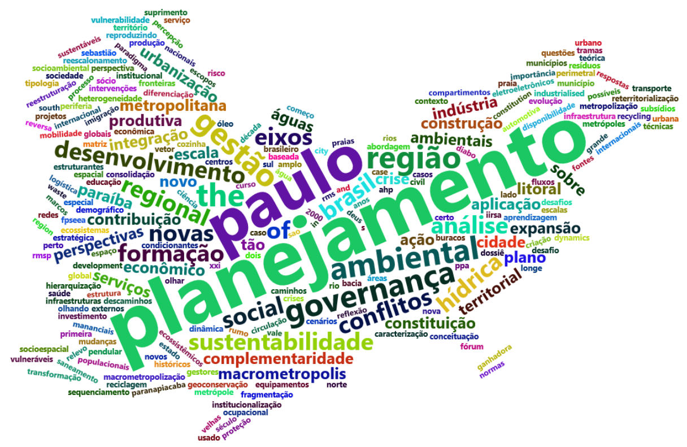

```{r setup, include=FALSE}
knitr::opts_chunk$set(
	echo = FALSE,
	message = FALSE,
	warning = FALSE
)

library(magrittr)
library(ggplot2)
```

```{r}
# url <- "https://docs.google.com/spreadsheets/d/1oEd1bktywsgeZoRRD3SdrM8zuxMdYwa9oBgN2cknbUM/edit?usp=sharing"
# 
# base_raw <- googlesheets4::read_sheet(url)
# 
# write.csv2(base_raw, file = "dados/base_2020_googlesheets.csv")

base_raw <- read.csv2("dados/base_2020_googlesheets.csv")

base <- base_raw %>% 
    dplyr::mutate(
    ano = as.character(year),
    ano = readr::parse_date(ano, format = "%Y")#,
    #ano = lubridate::year(ano)
    )

```


# Levantamento de estudos sobre a Macrometrópole Paulista: 

Beatriz Milz ^[Doutoranda no Programa de Pós-graduação em Ciência Ambiental (PROCAM), do Instituto de Energia e Ambiente (IEE) da Universidade de São Paulo (USP). Email: beatriz.milz@usp.br . ORCID: https://orcid.org/0000-0002-3064-4486 ], Pedro Roberto Jacobi ^[Professor Titular Senior do Instituto de Energia e Ambiente da Universidade de São Paulo. E-mail: prjacobi@gmail.com ORCID: https://orcid.org/0000-0001-6143-3019 ]


__Palavras-chave:__ Mudanças Climáticas, Governança da Água, Levantamento Bibliográfico, Região Metropolitana de São Paulo.


## Introdução

A Macrometrópole Paulista (MMP) (Figura 1) é a maior aglomeração urbana do Brasil, e abrange as regiões metropolitanas de São Paulo, Campinas, Sorocaba, Baixada Santista, Vale do Paraíba e Litoral Norte, as aglomerações urbanas de Jundiaí e Piracicaba, e as microrregiões de Bragantina e São Roque [@emplasaPlanoAcaoMacrometropole2012; @daeeMacrometropoleSumarioExecutivo2013]. Segundo a Empresa Paulista de Planejamento Metropolitano (EMPLASA), a MMP é composta por 174 municípios e em 2018 concentrava uma população de 33,6 milhões de habitantes [@emplasaRegiaoMetropolitanaSao2019]. 


```{r mapaemplasa, fig.cap="Figura 1: Mapa da MMP, localizada no Estado de São Paulo, Brasil. \\linebreak Fonte: @emplasaRegiaoMetropolitanaSao2019."}
knitr::include_graphics("imagens/mapa_emplasa_MMP.jpg")
```


A MMP apresenta grande complexidade em termos de gestão, e os problemas a serem enfrentados também apresentam grandes dimensões, tais como o déficit habitacional, estresse hídrico e abastecimento de água, entre outros [@castroExpansaoMacrometropoleCriacao2017]. Neste contexto, é importante que o planejamento realizado para Macrometrópole Paulista considere os efeitos das mudanças climáticas, pois, segundo o Painel Intergovernamental sobre Mudanças Climáticas (IPCC), elas irão amplificar os riscos existentes e criar novos riscos para os sistemas naturais e humanos [@ipcc_climate_2014]. 

Considerando a complexidade territorial apresentada pela MMP, é fundamental destacar a importância do conceito de governança ambiental. @lemosEnvironmentalGovernance2006 (p. 298) referem-se à governança ambiental como “o conjunto de processos regulatórios, mecanismos e organizações através dos quais os atores políticos influenciam as ações e resultados ambientais”. @jacobiGovernancaAmbientalEconomia2012 (p. 1471) apontam que “a governança ambiental envolve todos e cada um nas decisões sobre o meio ambiente, por meio das organizações civis e governamentais”. 


Segundo @pedrorobertojacobiCapitulo16Mudancas2018, “a governança ambiental do espaço urbano pode ser chave no alcance de uma condição de sustentabilidade e redução de vulnerabilidades aos desastres, principalmente aqueles relacionados aos eventos extremos decorrentes do aquecimento global, que tendem a se agravar” [@pedrorobertojacobiCapitulo16Mudancas2018, p. 349]. Considerando a importância do avanço nos estudos sobre a governança ambiental na Macrometrópole Paulista, neste trabalho é apresentado um levantamento exploratório de artigos científicos que abordam a MMP, publicados até 2018, com o objetivo de identificar pesquisas que tratem sobre a Governança Ambiental na MMP, no contexto das mudanças climáticas.

## Metodologia

As pesquisas foram realizadas em novembro de 2020, nos seguintes repositórios: Periódicos CAPES (http://www.periodicos.capes.gov.br/), *Scientific Electronic Library Online* (SciELO) (http://www.scielo.org/), *Scopus* (https://www.scopus.com/) e *Google Scholar* (https://scholar.google.com.br/). Foram pesquisados artigos que continham, em seu título,  algum dos seguintes termos: “Macrometrópole”, “Macrometrópole Paulista”, “Macrometrópole de São Paulo”, "Macrometropolização", “*Macrometropolis*” e “*Sao Paulo Macrometropolis*”.

Os resultados foram coletados e organizados em uma tabela, considerando os seguintes critérios: data da pesquisa, repositório onde o trabalho está indexado, título da publicação, autoras(es) do artigo, periódico científico na qual o trabalho foi publicado, idioma de publicação, ano de publicação e endereço online do trabalho (URL). Foram filtrados e apagados os artigos repetidos, considerando que existe a possibilidade de um mesmo trabalho ser indexado em mais de um repositório.


A etapa posterior constou em verificar os artigos encontrados, com a finalidade de responder às seguintes perguntas:  Em que ano os artigos foram publicados? Em quais periódicos os mesmos foram publicados? De que forma o projeto temático MacroAmb tem contribuído para a produção de conhecimento sobre a Macrometrópole Paulista?

Para a realização das diversas etapas da análise dos dados  [@wickhamR4DS2017; @silgeTextMining2017] (como importação, limpeza, manipulação, visualização) foi utilizado os softwares R [@R-base], RStudio [@rstudio] e os seguintes pacotes: `tidyverse` [@tidyverse2019], `googlesheets4` [@R-googlesheets4], `tidytext` [@tidytext2016], `wordcloud2` [@R-wordcloud2] e `tm` [@tm2008].
<!-- A governança é abordada nos artigos? Os autores relacionam a governança com quais abordagens (ex. ambiental, metropolitana, água, entre outros)? -->

## Resultados e discussões 

```{r}
artigos_ingles <-  base %>%  dplyr::filter(lang_en == TRUE, lang_pt == FALSE, lang_es == FALSE)


artigos_portugues <- base %>%
  dplyr::count(lang_pt) %>%
  dplyr::mutate(porc = round(n / sum(n) * 100)) %>% 
  dplyr::filter(lang_pt == TRUE) %>% 
  dplyr::pull(porc)
```

A pesquisa baseada nos critérios descritos anteriormente resultou em `r nrow(base)` artigos publicados em periódicos. Analisando o idioma das publicações, apenas `r nrow(artigos_ingles)` trabalho foram publicados exclusivamente em língua inglesa, enquanto `r artigos_portugues`% dos artigos foram publicados em português, demonstrando que as pessoas autoras consideram que este assunto é de maior importância local (Brasil). 

Na Figura 2 está representado no gráfico o número de publicações por ano, e os periódicos onde estes artigos foram publicados, evidenciando que os estudos sobre a MMP tem sido mais frequentes desde o ano 2015. 


```{r fig.cap="Figura 2:  Quantidade de artigos científicos, segundo o ano de publicação. \\linebreak Fonte: Elaborado pelas pessoas autoras.", out.width="100%", dpi = 600}
base %>% 
  dplyr::count(ano) %>% 
  ggplot() + 
  geom_col(aes(x = ano, y = n), fill = "lightblue") +
#  geom_text(aes(x = ano, y = n , label = n), vjust = -0.3)+
  theme_bw() +
  scale_x_date(date_labels = "%Y") +
  labs(x = "Ano", y = "Número de artigos")
```

Uma hipótese para o aumento de publicações desde o ano 2015 é a publicação do Plano de Ação da Macrometrópole Paulista 2013-2040 (PAM). O PAM foi coordenado pela EMPLASA e publicado em 2013, objetivou orientar a formulação e a execução de políticas públicas neste território. Segundo Tavares (2018, p. 128), “com a publicação do PAM, a Macrometrópole Paulista inseriu-se no sistema de planejamento regional do estado de São Paulo e se constituiu como uma região institucionalizada (porém não regulamentada por lei específica)”.


```{r}
porc_trabalhos_macroamb <- base %>%
  dplyr::filter(year >= 2017) %>% 
  dplyr::count(macroamb) %>% 
  dplyr::mutate(porc = round(n/sum(n)*100, 1)) %>% 
  dplyr::filter(macroamb == "VERDADEIRO") %>% 
  dplyr::pull(porc)
```
Além disso, outra hipótese para o aumento de publicações nos últimos anos é a existência do Projeto MacroAmb: "Governança ambiental da macrometrópole paulista face à variabilidade climática", sendo um projeto financiado pela Fundação de Amparo à Pesquisa do Estado de São Paulo (FAPESP), que foi iniciado em 2017. Considerando os artigos encontrados neste levantamento, `r porc_trabalhos_macroamb`% dos artigos encontrados  e publicados a partir de 2017 (o período de início do projeto) foram realizados com autoria ou co-autoria de pessoas pesquisadoras pertencentes ao Projeto MacroAmb.


Na Figura 3 estão representados os periódicos onde foram identificados o maior número de artigos publicados relacionados com o tema da MMP, sendo elas: Cadernos Metrópole, Ambiente & Sociedade, Revista Brasileira de Estudos Urbanos Regionais e Revista IberoAmericana de Urbanismo (RIURB).  


```{r fig.cap="Figura 3:  Quantidade de artigos científicos, segundo o periódico em que foi publicado. \\linebreak Fonte: Elaborado pelas pessoas autoras.", out.width="100%", dpi = 600 }

base %>%
  dplyr::mutate(revista_factor = forcats::fct_lump_min(revista, 2, other_level = "Outras"),
                revista_factor = gsub('(.{1,20})(\\s|$)', '\\1\n', revista_factor )) %>%
  dplyr::count(revista_factor) %>%
  dplyr::arrange(-n) %>%
  ggplot() +
  geom_col(aes(
    y = forcats::fct_reorder(revista_factor, n, .desc = TRUE),
    x = n
  ), fill = "lightblue") +
 # geom_text(aes(y = revista_factor, x = n , label = n), hjust = 2) +
  theme_bw() +
  
  labs(y = "Periódico", x = "Número de artigos")
```

A Figura 4 apresenta uma nuvem de frequência de palavras, elaborada a partir dos títulos dos artigos encontrados neste levantamento, e foi desenvolvida com a finalidade de apresentar de forma visual os temas abordados pelos artigos. Para a melhor visualização da nuvem, as palavras "Macrometrópole" e "Paulista", por serem palavras comuns na maioria dos títulos dos artigos. Não houve destaque para palavras relacionadas com mudanças climáticas nas nuvens de frequência de palavras, sendo que a palavra com maior frequência foi "planejamento", enquanto a palavra governança aparece com menor destaque. 


```{r fig.cap="Figura 4: Nuvem de frequência de palavras, elaborada a partir do título das publicações apresentadas neste estudo. Fonte: Elaborado pelas pessoas autoras."}

  
```


### Governança e a Macrometrópole Paulista


```{r}
artigos_citam_governanca <-
  base %>% dplyr::count(aborda_governanca) %>% dplyr::filter(aborda_governanca == TRUE) %>% dplyr::pull(n)


texto_governanca <- base %>% dplyr::filter(aborda_governanca == TRUE) %>% dplyr::select(governanca_e) %>% 
  dplyr::filter(!governanca_e %in% c("apenas governança", "não está claro")) %>% 
  tidyr::separate(governanca_e, into = c("governanca_1", "governanca_2" , "governanca_3" , "governanca_4", "governanca_5"),sep = ",") %>% 
  tidyr::pivot_longer(cols = tidyselect::everything()) %>% 
  dplyr::select(value) %>% 
  tidyr::drop_na() %>% 
  dplyr::mutate(value = stringr::str_to_title(value),
                value = stringr::str_squish(value),
                value = dplyr::case_when(value == "Água" ~ "da Água",
                                         TRUE ~ value)) %>% 
  dplyr::count(value, sort = TRUE) %>% 
  dplyr::top_n(5) %>% 
  dplyr::pull(value) %>% 
  knitr::combine_words(and = "e ")

```


Considerando os artigos apresentados neste levantamento, foram identificados `r artigos_citam_governanca` artigos que citam a governança. As abordagens que apareceram com mais frequência citadas com governança são: `r texto_governanca`.

```{r}
referencias_gov_agua  <- base %>% dplyr::filter(aborda_governanca == TRUE) %>% 
  dplyr::filter(stringr::str_detect(governanca_e, "água")) %>% 
  dplyr::arrange(year) %>% 
  dplyr::pull(bibtex) %>% 
  knitr::combine_words(sep = "; ", and = "")
```

Dentre os artigos que citaram a governança da água na MMP [`r referencias_gov_agua`], dois trataram diretamente sobre a crise hídrica que afetou a Macrometrópole Paulista entre 2014 e 2015, especialmente a Região Metropolitana de São Paulo (RMSP), e outro apresentou este acontecimento em sua contextualização. A gestão dos recursos hídricos atualmente transcende a escala da RMSP, pois apresenta complexas relações com outras regiões metropolitanas e unidades de gerenciamento de recursos hídricos, que estão incluídas no território da Macrometrópole Paulista. Segundo @richterConflitosNaMacrometropole2018 (p. 557):

> “num contexto de conflitos e disputas pelo uso da água proveniente das bacias hidrográficas que abastecem a região, torna-se importante pensar o desafio que a MMP apresenta enquanto território para a segurança hídrica e integração de seus recursos diante da disponibilidade e demanda em seus múltiplos usos”.


Os artigos que consideraram a abordagem de governança da água também dialogaram sobre as mudanças climáticas, que é uma questão que aumenta as incertezas sobre o abastecimento público da MMP. Segundo o IPCC, as mudanças climáticas irão aumentar os riscos de ocorrência de eventos de secas e escassez de água [@ipcc_climate_2014]. 

```{r}
referencias_gov_metropolitana  <- base %>% dplyr::filter(aborda_governanca == TRUE) %>% 
  dplyr::filter(stringr::str_detect(governanca_e, "metropolitana")) %>% 
  dplyr::arrange(year) %>% 
  dplyr::pull(bibtex) %>% 
  knitr::combine_words(sep = "; ", and = "")
```

Por outro lado,  os artigos que citaram a abordagem da governança metropolitana [`r referencias_gov_metropolitana`] não dialogaram com a questão das mudanças climáticas. 

## Conclusões

Desde 2015, houve um aumento do número de publicações científicas que tratavam do território da Macrometrópole Paulista. Destacando a importância da governança ambiental para o contexto apresentado, é importante que as pesquisas sobre este território sejam intensificadas, especialmente no contexto atual de incertezas e mudanças climáticas, com o intuito de avançar no entendimento sobre a governança ambiental na MMP. Espera-se que esse levantamento forneça subsídios para pesquisas futuras sobre a Macrometrópole Paulista.

## Agradecimentos

Os(as) autores(as) agradecem o apoio da Fundação de Amparo à Pesquisa do Estado de São Paulo (FAPESP) (processo n.	2018/23771-6). O trabalho é parte das atividades do projeto temático, em andamento, “Governança ambiental na Macrometrópole Paulista, face à variabilidade climática”, processo nº 15/03804-9, financiado pela FAPESP e vinculado ao Programa FAPESP de Pesquisa sobre Mudanças Climáticas Globais.

## Referências

```{r echo=FALSE}
knitr::write_bib(c('knitr', 'rmarkdown', "ggplot2", "dplyr", "readr", "lubridate", "forcats", "tidyverse", "tidytext", "tm", "wordcloud2", "googlesheets4"), 'referencias/packages.bib')
```

<!-- This '<div id="refs"></div>' needs to 
be here if you have appendix pages 
otherwise you can remove it.-->
<div id="refs"></div> 

